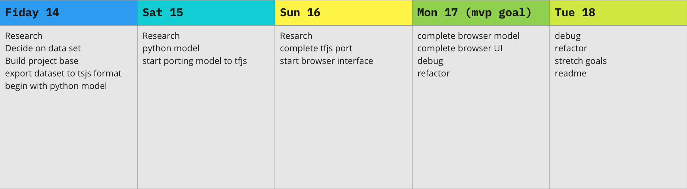
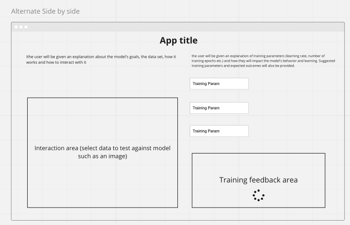

# 🤖 Machine learning playground  

Create and test your own AI in the browser! This project uses the mnist handwritten digits data set, loads it in the browser and gives the user the ability to test, trian and interact iwth an AI in the browser. 

Uses Tensorflow and Tesnflow.js

## Getting started

* fork and clone this repo
* this project requires a virtual enviroment so run `pip install virtualenv` if you don't have the virtualenv package
* cd into the repo directory and run `virtualEnv venv` to create the cirtual enviroment
* run `source venv/bin/activate` to start the virtual enviroment
* run `pip install -r requirements.txt` to install the required packages
* run `flask run` to fire up the server and navigate to `localhost:3000` to see the webpage
* you can also observe with a more basic model by running `python3 py-cli/playground.py`
  * matplotlib will display an example image
  * after it is closed, a model will be trained on the dataset
  * once training is complete, training statistics will be displyed the model will predict the image 
  * the program will exit when matplotlib is closed

**__NOTE:__** googlopolis can take a little while to send over the training image set for the first time (its around 8 meg), to be patient for around 30 seconds for it to load 

more information of setup can be found [here](https://github.com/SEI-SEA-1-25/Virtual-Environment-and-Flask-Setup)

You can [Visit the Live Heroku Deployment!](https://machine-learning-playground.herokuapp.com/) (this is a little buggy right now)

[this is a continuation of my GA p4 project found here](https://github.com/weston-bailey/P4-tensorflow-playground)
 

## Original Project Pitch

### 1. How do you plan on learning/implementing this new technology?

the docs:

[tensorflow](https://www.tensorflow.org/api_docs/python/tf)

[tensorflow.js](https://js.tensorflow.org/api/latest/)

tensorflow tutorials:

[freecodecamp python](https://www.youtube.com/watch?v=tPYj3fFJGjk)

[freecode camp js](https://www.youtube.com/watch?v=EoYfa6mYOG4)

[pythonprogramming.net](https://pythonprogramming.net/machine-learning-tutorials/)

Broad Machine Learning tutorials:

[lynda intro to machine learning](https://www.linkedin.com/learning/artificial-intelligence-foundations-machine-learning/what-it-means-to-learn?u=56684793)

[the nature of code neural networks chapter (this book is so awesome)](https://natureofcode.com/book/chapter-10-neural-networks/)

Examples repos:

[tensorflow at github](https://github.com/tensorflow)

Additional resources used:

[AI wiki](https://docs.paperspace.com/machine-learning/wiki/accuracy-and-loss)

[google ML crash course](https://developers.google.com/machine-learning/crash-course)

[google mnist classifacation](https://codelabs.developers.google.com/codelabs/tfjs-training-classfication/index.html#0)

[4 part tfjs tuts at medium](https://medium.com/ailab-telu/learn-and-play-with-tensorflow-js-introduction-d4d19e9982ea)

[drawable canvas mnsit with tfjs](https://towardsdatascience.com/deploying-a-simple-machine-learning-model-into-a-webapp-using-tensorflow-js-3609c297fb04)

[intro to tfjs](https://blog.tensorflow.org/2018/04/a-gentle-introduction-to-tensorflowjs.html)

[tfjs cheatsheet](https://towardsdatascience.com/50-tensorflow-js-api-explained-in-5-minutes-tensorflow-js-cheetsheet-4f8c7f9cc8b2)

[fashion mnist with drawable canvas](https://github.com/novasush/visualizing-fashion-mnist-on-browser)

[image kernals](https://setosa.io/ev/image-kernels/)

[maxpooling in CNNs](https://www.quora.com/What-is-max-pooling-in-convolutional-neural-networks)

[cnn convNets](https://cs231n.github.io/convolutional-networks/)

[learning rate](https://machinelearningmastery.com/understand-the-dynamics-of-learning-rate-on-deep-learning-neural-networks/)

### 2. & 3. What is your goal with this project?/Who is the user for your app?/What is the User Flow?

Personal goal: To gain a foundational knowledge of machine learning and the use of tensorflow.

App goal: Apply tensorflow in a 'machine learning playground' style app for a user to interact with. 

Overall plan: I would like to create a simple ts model in python and port it over to tensorflow.js so the a user could interact it in the browser.

the deliverable of this project will be aimed at users who are interested in understanding machine learning by interacting with an ai directly by training it and seeing the results

the user experience would be something like this: 
1. the user will be given an explanation about the model's goals, the data set, how it works and how to interact with it
2. the user can interact with the untrained model to better understand the goals of training it
3. the user will be given an explanation of training parameters (learning rate, number of training epochs etc.) and how they will impact the model's behavior and learning. Suggested training parameters and expected outcomes will also be provided. 
4. the user can set training parameters for the model and active training for the model that will occur in the browser
5. the user will be given feedback on the model's training as it occurs (learning rate, loss, epochs complete, ect)
6. the user can interact with the model once again after it has been trained to see how the training has impacted the models behavior
7. the user will be given the option to continue training the model with the same parameters, revised parameters or start fresh on an untrained model.

Stretch goals would include:

* provide different types of neural networks for the user to train: 
1. such as an option to train a single layer neural network or a deep neural network to observe the differences in accuracy, and speed of training. 
2. provide the ability to select different activation functions (softmax, binary) to observe the different outcomes

* provide a single neuron to interact with too illustrate how artificial neural networks function on a granular level

* provide a non tensorflow neural network for the user to train/interact with so they can it compare to tensorflow

* include alternative types on machine learning such as an unsupervised learning model

### 4. Any potential roadblocks you think you might run into?

1. I need to decide on a suitable dataset for training:

* It is my understanding so far that much of the work for creating an ai is deciding how to configure a model to work with a particular dataset and then grooming and formatting the dataset so that it can be used with the ML model. 

* I don't have the understanding/expertise to even begin to do this with a dataset, I would like to use preformatted ML dataset such as one from the [Keras API](https://keras.io/api/datasets/). 

2. the tensorflow versioning and compatibility is a complicated disaster:

* tensorflow v1 code is not compatible with tensorflow v2 code, and tensorflow's v2 backwards compatibilty mode is basically useless most of the time. 
 
* Tensorflow v1 isn't compatible with newer versions of python and the latest version of python only works with the latest version of tensorflow v2. 

* Many really great instructional materials have been written for tensorflow v1 or even earlier versions of v2, but I haven't been able to use them because of compatibility issues. 

* I looked into a python version manager, but that was a whole mess I couldn't navigate.

* at least tensorflow.js works without version issues so far

### Daily plan:

### 3 Wireframe:

